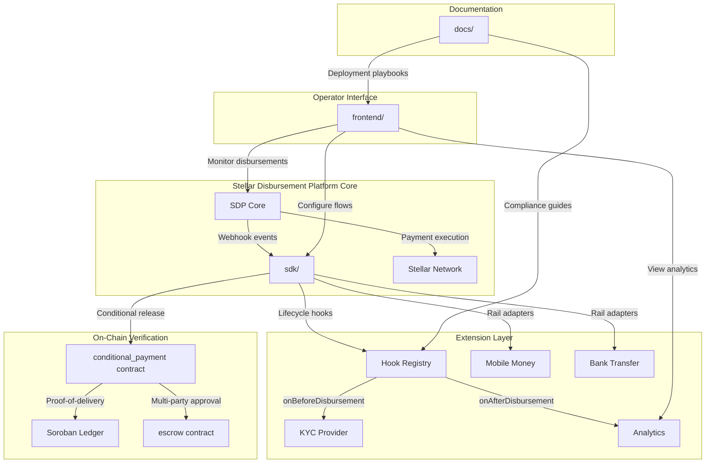

<p align="center">
  
</p>

<p align="center">
  <a href="https://www.drips.network/wave"></a>
  <a href="https://opensource.org/licenses/Apache-2.0"></a>
  <a href="https://stellar.org"></a>
  <a href="https://github.com/cascade-network"></a>
</p>

<h1 align="center">🌍 Cascade Network</h1>
<h3 align="center">Open Extension Infrastructure for the Stellar Disbursement Platform</h3>

<p align="center">
  <em>Custom compliance hooks, alternative payment rails, and on-chain conditional escrow for the Stellar Disbursement Platform (SDP) — letting NGOs, governments, and fintechs customize humanitarian aid and payroll delivery without forking the core platform.</em>
</p>

<p align="center">
  <strong>Status: early-stage, single-repo monorepo · all Wave task-backlog items currently open for contribution</strong>
</p>

---

## Table of Contents

1. [Why Cascade Network](#why-cascade-network)
2. [Monorepo Layout](#monorepo-layout)
3. [Architecture](#architecture)
4. [Quick Start](#quick-start)
5. [Frontend — Operator Portal](#frontend--operator-portal)
6. [Contracts — Conditional Payment Escrow](#contracts--conditional-payment-escrow)
7. [SDK — SDP Extension Layer](#sdk--sdp-extension-layer)
8. [Docs — Deployment Playbook & Hook Guides](#docs--deployment-playbook--hook-guides)
9. [Drips Wave — Contributing & Earning Points](#drips-wave--contributing--earning-points)
10. [Project Status & Roadmap](#project-status--roadmap)
11. [Community & Support](#community--support)
12. [License](#license)

---

## Why Cascade Network

The [Stellar Disbursement Platform (SDP)](https://github.com/stellar/stellar-disbursement-platform) gives NGOs, governments, and fintechs a solid core for moving aid and payroll on Stellar — but it's deliberately generic. Real-world disbursement programs need region-specific KYC/AML logic, local payment rails (mobile money, bank transfer) alongside Stellar-native payments, and proof-of-delivery before funds release for higher-value or compliance-sensitive transfers. Today that means forking SDP or bolting on brittle middleware.

**Cascade Network is an extension layer**, not a fork: a hook system that runs custom logic at key points in the disbursement lifecycle, a rails-adapter interface for non-Stellar payment methods, and Soroban escrow contracts that hold funds until a condition (delivery confirmation, oracle approval, or timeout) is met.

| Problem | Cascade Network's Approach |
|---|---|
| SDP is powerful but not customizable for specialized compliance | A plugin/hook system injected at key lifecycle points (`onBeforeDisbursement`, `onAfterDisbursement`, `onFailure`) |
| Aid organizations need local payment rail integrations | A `RailsAdapter` interface, with mobile money and bank transfer adapters as reference implementations |
| No conditional, auditable verification of aid delivery | Soroban escrow contracts (`conditional_payment`, `escrow`) with programmable release conditions |
| Analytics are limited to SDP's built-in views | An operator portal with disbursement-flow and volume/success-rate dashboards |

This is a Wave-5 Stellar ecosystem project: an early-stage scaffold with a defined architecture and an open task backlog (see [Drips Wave](#drips-wave--contributing--earning-points) below), not a deployed production system. Anything described below as a capability of the SDK, contracts, or portal reflects what's scaffolded and in progress, not a completed or field-tested product — see [Project Status & Roadmap](#project-status--roadmap) for the honest breakdown of what currently exists versus what's an open contribution task.

---

## Monorepo Layout

This repository was consolidated from four separate repos (`cascade-network-portal`, `cascade-network-contracts`, `cascade-network-sdk`, `cascade-network-docs`) into a single monorepo so the whole project can be tracked and funded as one unit:

```
cascade-network/
├── frontend/      # React + Vite operator portal (formerly cascade-network-portal)
├── contracts/     # Soroban escrow contracts, Rust (formerly cascade-network-contracts)
├── sdk/           # TypeScript SDP extension SDK (formerly cascade-network-sdk)
├── docs/          # Docusaurus documentation site (formerly cascade-network-docs)
├── WAVE_TASKS.md  # Point-weighted task backlog for Drips Wave contributors
├── WAVE_ISSUES.md # Full issue specs, organized by component
└── .github/       # Issue templates, PR template, per-component CI workflows
```

Each component keeps its own `package.json`/`Cargo.toml` and can still be built and tested independently — only the repository-level packaging changed, not the internal structure of each piece. CI runs per-component, scoped by path, via the workflows in `.github/workflows/`.

---

## Architecture



---

## Quick Start

### Prerequisites
- Node.js 20+
- Rust 1.75+ with the `wasm32-unknown-unknown` target (for contracts)
- Stellar CLI 21+
- [Freighter wallet](https://www.freighter.app/) browser extension (for the portal)
- Access to a Stellar Disbursement Platform instance (for SDK integration)

### Clone the monorepo

```bash
git clone https://github.com/cascade-network/cascade-network.git
cd cascade-network
```

### Run the SDK

```bash
cd sdk
npm install
npm run build && npm test
```

### Run the portal

```bash
cd frontend
npm install
cp .env.example .env
npm run dev
# open http://localhost:5173
```

### Build & test the contracts

```bash
cd contracts
rustup target add wasm32-unknown-unknown
stellar contract build
cargo test
```

### Run the docs site

```bash
cd docs
npm install
npm run dev
# open http://localhost:3000
```

---

## Frontend — Operator Portal

`frontend/` — React 18 · TypeScript · Vite · Recharts · Tailwind

The operator dashboard for Cascade Network: configure batch disbursements, monitor payment status in real time, manage compliance hook plugins, and view volume/success-rate analytics.

**Planned features** (see `WAVE_TASKS.md` for current implementation status of each):
- Batch disbursement builder with per-recipient amount and memo
- Live payment status tracker (pending / completed / failed)
- Plugin manager — toggle compliance hooks without code changes
- Analytics dashboard — volume, success rate, failure breakdown, built on Recharts
- CSV export of disbursement history

---

## Contracts — Conditional Payment Escrow

`contracts/` — Rust · Soroban SDK

On-chain escrow contracts that release funds only when a defined condition is met — an authorised oracle confirming delivery, multi-party approval, or a timeout — for higher-value or compliance-sensitive disbursements.

- `conditional_payment` — `deposit`, `confirm`, `timeout_refund`, `cancel`
- `escrow` — multi-party approval with arbiter dispute resolution
- Each contract compiles to an independent WASM module and is independently deployable
- All contracts emit structured Soroban events, designed to be consumed by indexers such as [Lumina](https://github.com/lumina-vision)

Run `cargo clippy -- -D warnings` before opening a PR — CI enforces zero warnings. `stellar contract build` produces `.wasm` artifacts under `target/wasm32-unknown-unknown/release/`.

---

## SDK — SDP Extension Layer

`sdk/` — TypeScript · `@stellar/stellar-sdk`

The extension layer over SDP. Exposes:

- **`HookRegistry`** — ordered `onBeforeDisbursement` / `onAfterDisbursement` / `onFailure` plugins
- **`RailsAdapter`** — an interface for routing disbursements through mobile money or bank transfer instead of (or alongside) Stellar-native payments
- **`ConditionalPaymentClient`** — a thin client wrapping the on-chain escrow contracts in `contracts/`
- **`DisburseSDK`** — the top-level entry point exported from `sdk/src/index.ts`, tying the hook registry, rails adapters, and conditional payment client together

### Example: registering compliance and analytics hooks

```typescript
import { DisburseSDK } from '@cascade-network/sdk';

const sdk = new DisburseSDK({
  sdpEndpoint: 'https://sdp.example.org',
  apiKey: process.env.SDP_API_KEY,
});

sdk.hooks.onBeforeDisbursement(async (payload) => {
  const result = await myKYCProvider.verify({
    id: payload.recipientId,
    amount: payload.amount,
    country: payload.country,
  });
  if (!result.passed) {
    throw new Error(`KYC check failed: ${result.reason}`);
  }
});

sdk.hooks.onAfterDisbursement(async (payload) => {
  await analytics.track('disbursement_completed', {
    recipientId: payload.recipientId,
    amount: payload.amount,
    currency: payload.currency,
    timestamp: new Date(),
  });
});

await sdk.start({ port: 3000 });
```

### Example: conditional payment via Soroban

```typescript
import { ConditionalPaymentClient } from '@cascade-network/sdk';

const payment = new ConditionalPaymentClient({
  contractId: 'CDA...',
  rpcUrl: 'https://soroban-testnet.stellar.org',
});

await payment.create({
  donor: 'GDONOR...',
  recipient: 'GRECIPIENT...',
  amount: 1000n,
  asset: 'USDC:ISSUER...',
  condition: 'proof_of_delivery',
  expiryLedger: currentLedger + 17280, // ~24 hours
});

await payment.submitProof({
  paymentId: 'payment_123',
  proofHash: '0x...', // e.g. an IPFS hash of a delivery photo
  recipient: 'GRECIPIENT...',
});
```

Both examples describe the intended SDK surface as scaffolded in `sdk/src/`; check `WAVE_TASKS.md` for which pieces are implemented versus open for contribution.

---

## Docs — Deployment Playbook & Hook Guides

`docs/` — Docusaurus 3 · Markdown

Documentation for self-hosting Cascade Network alongside SDP, writing custom compliance hooks, and implementing alternative payment-rail adapters, aimed at NGO and government operator teams. Planned content includes a full self-hosting deployment playbook, a hook-authoring guide with worked KYC/sanctions-screening examples, a custom rails-adapter guide (mobile money example), and a TypeDoc-generated SDK API reference.

---

## Drips Wave — Contributing & Earning Points

Cascade Network participates in the **Stellar Drips Wave** program ([drips.network/wave](https://www.drips.network/wave)). Contributors pick up point-weighted tasks, submit a PR, and earn rewards once it's merged.

**Point values:**
- 🟢 **Trivial** — 100 points
- 🟡 **Medium** — 150 points
- 🔴 **High** — 200 points

The full, up-to-date backlog lives in two files:
- [`WAVE_TASKS.md`](./WAVE_TASKS.md) — task list with files to edit and acceptance criteria
- [`WAVE_ISSUES.md`](./WAVE_ISSUES.md) — full issue specs, organized by component (`contracts`, `sdk`, `frontend`, `docs`)

**How to contribute:**
1. Browse open tasks in `WAVE_TASKS.md` / `WAVE_ISSUES.md`
2. Sign in at [drips.network/wave](https://www.drips.network/wave) with your GitHub account and apply to an issue
3. Fork the repo, create a branch (`feat/your-feature`), implement the task
4. Open a PR referencing the issue (`Closes #XX`), with tests and docs updated
5. Earn points once merged and the Wave cycle closes

See [`CONTRIBUTING.md`](./CONTRIBUTING.md) for code style, branching, and PR requirements, and [`CODE_OF_CONDUCT.md`](./CODE_OF_CONDUCT.md) for community guidelines.

---

## Project Status & Roadmap

**Honest current status:** every task in `WAVE_TASKS.md` is currently marked **Open** — this is a scaffolded, early-stage project with a defined architecture, not a deployed or field-tested system. There are no production disbursements, pilot NGO partners, or live deployments to report yet.

**Now (scaffolded, open for contribution):**
- Hook registry, rails-adapter interface, and conditional-payment client interfaces defined in the SDK
- `conditional_payment` and `escrow` contract skeletons in `contracts/`
- Portal shell with routing in `frontend/`
- Docs site scaffold in `docs/`

**Next:**
- Implement and test the mobile money and bank transfer rail adapters
- Implement and test `conditional_payment` and `escrow` contract logic, including timeout and dispute paths
- Wire the portal's batch-submit flow to a live `DisburseSDK` instance
- Write the self-hosting deployment playbook

**Later / vision:**
- Biometric or other proof-of-delivery verification integrations
- Offline-friendly payment flows for low-connectivity field conditions
- Fraud-detection heuristics over disbursement analytics
- Integration patterns for existing humanitarian-sector platforms

---

## Community & Support

- **Issues** — [GitHub Issues](https://github.com/cascade-network/cascade-network/issues) for bugs and feature requests
- **Discussions** — GitHub Discussions for questions and design conversations
- **Contributing** — [`CONTRIBUTING.md`](./CONTRIBUTING.md)
- **Code of Conduct** — [`CODE_OF_CONDUCT.md`](./CODE_OF_CONDUCT.md)
- **Security** — [`SECURITY.md`](./SECURITY.md) for responsible disclosure
- **Maintainer** — [@phantomcall](https://github.com/phantomcall)

---

## License

Distributed under the **Apache License 2.0**. See [`LICENSE`](./LICENSE) for details.

```
Copyright 2026 Cascade Network Contributors

Licensed under the Apache License, Version 2.0 (the "License");
you may not use this file except in compliance with the License.
You may obtain a copy of the License at

    http://www.apache.org/licenses/LICENSE-2.0

Unless required by applicable law or agreed to in writing, software
distributed under the License is distributed on an "AS IS" BASIS,
WITHOUT WARRANTIES OR CONDITIONS OF ANY KIND, either express or implied.
See the License for the specific language governing permissions and
limitations under the License.
```

<p align="center">
  <strong>Building the open rails for humanitarian and financial aid on Stellar.</strong>
</p>
