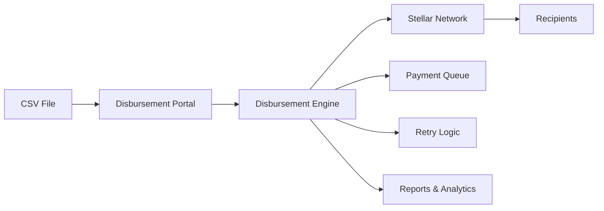

# Introduction

Welcome to Cascade Network - the automated bulk payment and distribution platform for Stellar.

## What is Cascade Network?

Cascade Network enables organizations to send bulk payments to thousands of recipients efficiently and securely. Whether it's payroll, airdrops, rewards, or grants - Cascade Network handles it all with minimal fees and maximum reliability.

## Key Features

- **Bulk Payments** - Send to 10,000+ recipients in one batch
- **CSV Import** - Easy recipient list management
- **Scheduling** - Set payment dates and times
- **Multi-Asset** - Support for any Stellar asset
- **Approval Workflows** - Multi-signature support
- **Detailed Reporting** - Track every payment

## Why Cascade Network?

Traditional bulk payment systems are slow and expensive. Cascade Network offers:

- **Lightning Fast** - Payments settle in 5 seconds
- **Ultra Low Cost** - $0.0001 per transaction
- **Global Reach** - Send to any Stellar account worldwide
- **No Intermediaries** - Direct peer-to-peer transfers
- **Full Transparency** - Every transaction on-chain

## Quick Example

```typescript
import { BulkPayment } from '@cascade-network/sdk';

// Create bulk payment
const batch = await BulkPayment.create({
  asset: 'USDC',
  recipients: [
    { address: 'GABC...', amount: '100' },
    { address: 'GDEF...', amount: '150' },
    // ... 10,000 more
  ]
});

// Execute
await batch.execute();

// Track status
const status = await batch.getStatus();
console.log(`${status.completed}/${status.total} payments sent`);
```

## Use Cases

- **Payroll Distribution** - Pay employees globally
- **Token Airdrops** - Distribute tokens to holders
- **Rewards Programs** - Send rewards to customers
- **Grant Distribution** - Disburse grants to recipients
- **Affiliate Payouts** - Pay commissions to partners
- **Refunds** - Bulk refund processing

## Architecture



## Payment Flow

1. **Import** - Upload recipient list via CSV or API
2. **Review** - Verify amounts and addresses
3. **Approve** - Multi-sig approval if required
4. **Schedule** - Set payment date/time
5. **Execute** - Automated batch processing
6. **Report** - Download success/failure reports

## Getting Started

- [Installation](./getting-started/installation) - Set up the portal
- [First Disbursement](./tutorials/first-disbursement) - Send your first batch
- [CSV Format](./guides/csv-format) - Prepare recipient lists
- [API Reference](./reference/api) - Programmatic access

## Security

- **Multi-signature** - Require multiple approvals
- **Address Validation** - Verify all addresses before sending
- **Amount Limits** - Set per-transaction and daily limits
- **Audit Logs** - Complete payment history
- **Role-based Access** - Control who can create/approve payments

## Community

- [GitHub](https://github.com/cascade-network/cascade-network)
- [Discord](https://discord.gg/cascade-network)
- [Drips Wave](https://www.drips.network/wave) - Contribute and earn

Ready to streamline your bulk payments? Let's get started!
